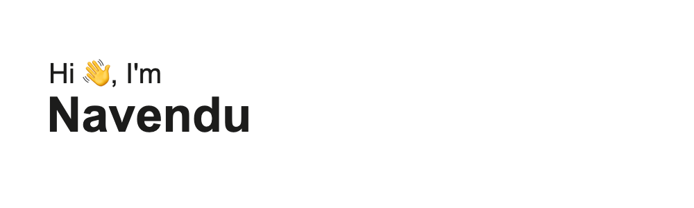

<!-- 
### 👉 [Click to view my resume](https://docs.google.com/document/d/1zZodVBx2rHxPBSdWyBegGp5850VbA9vFPpOI_WIaKh8/edit?usp=sharing) 📄

**NavenduDuari/NavenduDuari** is a ✨ _special_ ✨ repository because its `README.md` (this file) appears on your GitHub profile.

Here are some ideas to get you started:

- 🔭 I’m currently working on ...
- 🌱 I’m currently learning ...
- 👯 I’m looking to collaborate on ...
- 🤔 I’m looking for help with ...
- 💬 Ask me about ...
- 📫 How to reach me: ...
- 😄 Pronouns: ...
- ⚡ Fun fact: ...

### Languages 📖
> 

### Databases 💾
> 

### Web technologies 🌐
> 

### Editor/IDE 💻
> 

### DSA 🧠 (click to view profile)
> 
>
> 

### Contact me ☎ (click to connect)
> 

-->

Navendu is a polyglot developer with 4 years of experience and a master's degree in computer science. He is noticed for the first principle thinking, completeness of projects, and ownership of responsibilities. Navendu is known for his data-driven approach to development, effectively utilizing data to optimize growth, cost, and productivity. He excels in collaborating with product teams, aligning engineering efforts with strategic product objectives to drive success.

------------

